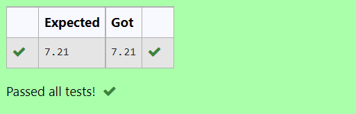

# DISTANCE-BETWEEN-TWO-POINTS

## AIM:
To write a python program to find the distance two 2 points
## ALGORITHM:
### Step 1: 
Get the two values from the user
### Step 2: 
Substitute the values in the distance formula 

   
### Step 3: 
Print the format 
### Step 4: 
End the program
 
### PROGRAM:
```
Distance between two variables
Name : Sakthiswar S
Ref No : 22008587
```
```python
  import math
l2 =[10,6]
l1 =[4,2]
d = math.sqrt(((l2[0]-l1[0])**2)+((l2[1]-l1[1])**2))
print("{:.2f}".format(d))
```

### OUTPUT:



### RESULT:
Hence a python program to find the distance two 2 points has return successfully
